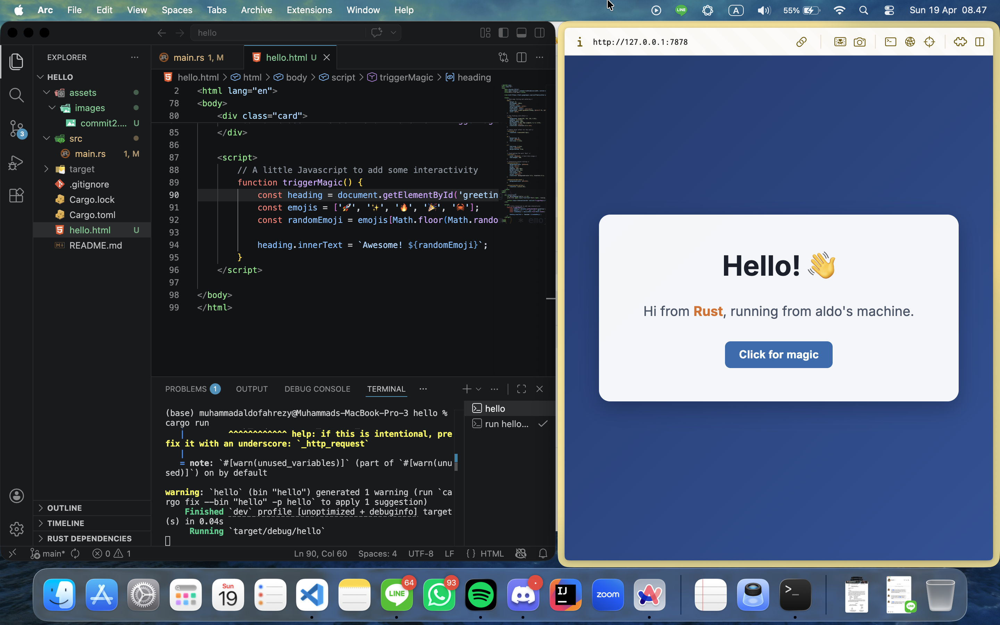
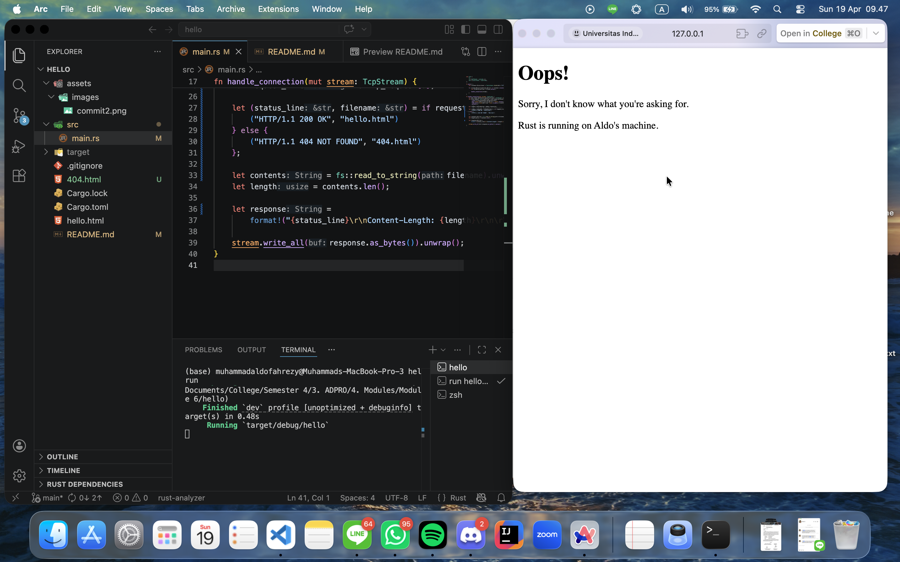
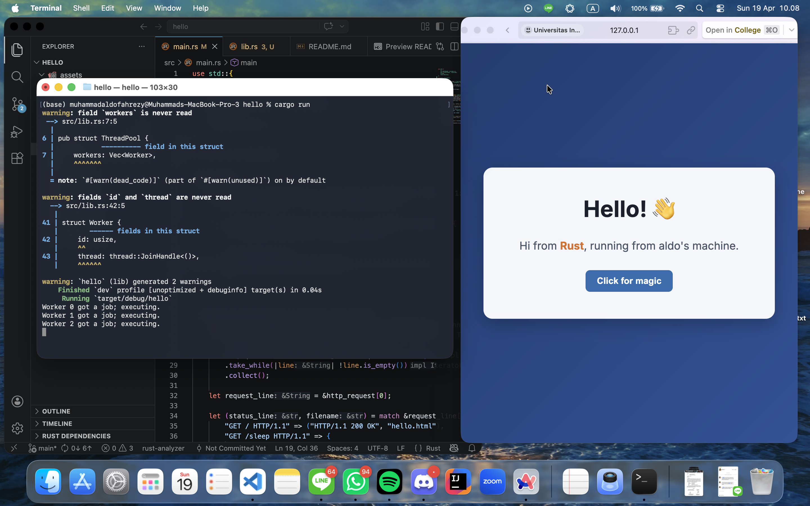

# Reflection 1

In this milestone, I implemented a basic single-threaded web server in Rust that listens for incoming TCP connections on 127.0.0.1:7878. The TcpListener::bind() method binds the server to that address and port, and the incoming() method returns an iterator over connection attempts, allowing the server to handle each request sequentially in a loop.

I added a helper functin handle_connection that receives a TcpStream which represents the raw bidirectional communication channel between the server and the browser. Inside the function, a BufReader is wrapped around the stream to enable efficient, line-by-line reading of the incoming data, since raw TCP streams do not have built-in buffering.

The HTTP request is parsed by reading lines from the BufReader using .lines(), mapping each result to unwrap it, and collecting them until an empty line is encountered where this empty line signals the end of the HTTP request headers according to the HTTP/1.1 protocol. The result is stored as a Vec<String> which is then printed to the console for inspection.

From the output, I can see that a browser request consists of a request line (e.g., GET / HTTP/1.1), followed by several header fields such as Host, User-Agent, Accept, and Connection. These headers give the server information about who is making the request and what kind of response the client can handle.

One interesting observation is that the browser often sends multiple connections in quick succession. Upon investigation, I discovered that this behaviour is pretty much expected because modern browsers are designed to proactively retry or make additional requests (e.g., for a favicon), which is why multiple "Connection established!" messages appear even from a single browser tab visit. This highlights that even a simple web server must be prepared to handle more than one request per user interaction.

## Breaking Down the Request Output

From the actual output I received, here is a breakdown of it according to my research:

- **`GET / HTTP/1.1`** is the request line. It tells the server that the browser wants to `GET` the root path `/` using HTTP version 1.1.
- **`Host: 127.0.0.1:7878`** specifies the target host and port the browser is connecting to.
- **`Connection: keep-alive`** means that the browser requests the connection to stay open for potential follow-up requests, rather than closing it immediately after one response.
- **`sec-ch-ua`** is a Client Hints header introduced by Chromium-based browsers that tells the server which browser brand and version is being used. Here it indicates Chromium 147.
- **`sec-ch-ua-mobile: ?0`** indicates that the request is NOT coming from a mobile device (`?0` means false).
- **`sec-ch-ua-platform: "macOS"`** tells the server the operating system of the client, in this case macOS.
- **`Upgrade-Insecure-Requests: 1`** means the browser prefers to receive a secure (HTTPS) version of the page if available.
- **`User-Agent`** is a detailed string describing the browser and OS. Here it shows Chrome 147 running on macOS, built on the WebKit/537.36 engine.
- **`Accept`** lists the content types the browser can handle, in order of preference. It prefers HTML, then XHTML, XML, and also accepts image formats like `avif` and `webp`.
- **`Sec-Fetch-Site: cross-site`** indicates that this request is coming from a different origin than the target, likely because the browser was navigating from a different tab or address.
- **`Sec-Fetch-Mode: navigate`** tells the server this is a top-level navigation request (e.g., typing a URL in the address bar).
- **`Sec-Fetch-Dest: document`** means the browser expects to receive an HTML document as the response.
- **`Accept-Encoding: gzip, deflate, br, zstd`** lists the compression formats the browser supports, so the server can compress the response to save bandwidth.
- **`Accept-Language: en-GB,en-US;q=0.9,en;q=0.8`** means the browser prefers British English, then American English, then generic English as fallback.
- **`Cookie`** contains a `csrftoken`, which is a Cross-Site Request Forgery protection token. This was likely stored from a previous session on another local application (e.g., a Django app), and the browser automatically attached it since the host is `127.0.0.1`.

Overall, this output shows just how much metadata a browser sends with even the simplest request. All of this information is available to the server to decide how to respond, though for now our server only prints it and does nothing else with it.

## "Didn't Send Any Data" vs "Refused to Connect"

When visiting `127.0.0.1:7878` with the server running, the browser shows an error along the lines of **"the server didn't send any data"**. This is different from the **"refused to connect"** error that appears when the server is not running at all, and the distinction is important.

- **"Refused to connect"** means the TCP connection itself was rejected. In other words, no process is listening on that port, so the operating system immediately sends back a TCP RST (reset) packet. The browser never even gets to exchange data with anything.
- **"Didn't send any data"** means the TCP connection was successfully established. This indicates that our Rust server accepted it and even printed "Connection established!", but then sent nothing back. The browser completed the handshake, waited for an HTTP response, and received only silence before the connection closed. Since we haven't written any response logic yet in this milestone, our server simply drops the stream after printing the request, causing the browser to complain that it got no data.

This distinction confirms that our server is working correctly at the TCP level. The connection is being accepted and the request is being read. What is missing so far is the part where the server writes an HTTP response back to the stream, which will be addressed in the next milestone.

# Reflection 2

In this milestone, I modified the `handle_connection` function so that the server now sends back an actual HTTP response that the browser can render, rather than just printing the request and closing the connection silently.

The key changes were adding `fs` to the imports and constructing a proper HTTP response string. The `fs::read_to_string("hello.html")` call reads the entire HTML file into a `String`. The response is then built using `format!()` with three parts separated by `\r\n` as required by the HTTP/1.1 protocol:

- **Status line**:`HTTP/1.1 200 OK` tells the browser the request was successful.
- **Headers**: `Content-Length: {length}` tells the browser exactly how many bytes to expect in the body, so it knows when the response ends.
- **Blank line**: The `\r\n\r\n` sequence separates the headers from the body, which is a strict requirement of the HTTP spec.
- **Body**: The actual HTML content read from `hello.html`.

Finally, `stream.write_all(response.as_bytes())` converts the response string into raw bytes and writes it back to the TCP stream, which is what the browser receives and renders.

For the HTML file itself, I created a styled page using CSS with a centered card layout, a gradient background, and a Google Fonts import for the Inter typeface. I also added a small JavaScript function `triggerMagic()` that randomly changes the heading emoji when the button is clicked to demonstrate that the server is serving a fully functional HTML document, not just plain text, since the browser correctly executes the embedded CSS and JavaScript.

One thing worth noting is that even though our server has no concept of CSS, JavaScript, or fonts, it doesn't need to. It simply serves the raw HTML file, and the browser takes care of parsing and executing everything inside it, including fetching the Google Fonts stylesheet from an external URL. This highlights the separation of concerns between the server (delivering content) and the browser (rendering and executing it).

# Reflection 3

In this milestone, I added request validation so that the server no longer blindly returns `hello.html` for every request. Instead, it now inspects the first line of the HTTP request and selectively responds based on what path was requested.

## How Request Validation Works

Previously, the server read all request headers into a `Vec<String>` and ignored them entirely when building the response. Now, I extract the first line of that vector as `request_line` and compare it against `"GET / HTTP/1.1"`. If it matches, the server responds with `hello.html` and a `200 OK` status. If it does not match, meaning the browser requested any other path, the server responds with `404.html` and a `404 NOT FOUND` status.

This is the fundamental mechanism behind how real web servers route requests. The first line of every HTTP request always follows the format `METHOD PATH HTTP/VERSION`, so checking it is sufficient to determine what the client wants.

## Why Refactoring Was Needed

Before refactoring, the `if` and `else` branches were nearly identical. Both branches read a file, calculated its length, formatted a response string, and wrote it to the stream. The only difference between the two was the `status_line` value and the `filename` being read. This is a clear violation of the Don't Repeat Yourself (DRY) principle. If I ever wanted to change how the response is formatted, I would have to update the same logic in two separate places, which is error-prone.

The refactored version solves this by isolating the only two things that actually differ, `status_line` and `filename`, into a single `if`/`else` expression that returns them as a tuple. Rust allows `if`/`else` to be used as an expression that evaluates to a value, which makes this pattern clean and idiomatic. The rest of the logic such as reading the file, computing the length, formatting the response, and writing to the stream now lives in one place outside the conditional, and only runs once regardless of which branch was taken.

This makes the code significantly easier to read and maintain. The separation is clear: the `if`/`else` decides *what* to respond with, and the code below it handles *how* to send it.

# Reflection 4

In this milestone, I simulated a slow request to demonstrate the core limitation of a single-threaded web server. No new server capability was added and the purpose of this milestone is purely to observe and understand the problem that motivates the upgrade to a multithreaded server.

## What Was Added

I added a new route `/sleep` to the request handler. When the server receives a `GET /sleep HTTP/1.1` request, it calls `thread::sleep(Duration::from_secs(10))` before sending back the usual `hello.html` response. This simulates a request that takes a long time to process, such as a heavy database query or an external API call in a real application.

The match block now handles three cases:

- `GET / HTTP/1.1`: responds immediately with `hello.html` and `200 OK`
- `GET /sleep HTTP/1.1`: sleeps for 10 seconds, then responds with `hello.html` and `200 OK`
- Anything else: responds with `404.html` and `404 NOT FOUND`

## Observing the Problem

To see the problem, I opened two browser tabs simultaneously. In the first tab I visited `127.0.0.1:7878/sleep`, and in the second tab I visited `127.0.0.1:7878`. The expected behavior would be that the root `/` request responds instantly regardless of what other requests are happening. However, what actually happens is that the second tab is completely frozen and cannot load until the `/sleep` request in the first tab finishes its 10 second sleep.

This happens because the server runs on a single thread. The `for stream in listener.incoming()` loop processes one connection at a time in sequence. While the thread is blocked inside `thread::sleep()` handling the `/sleep` request, no other connection can be accepted or processed. The server is essentially unresponsive to the entire world for those 10 seconds.

## Why This Is a Serious Problem

In a real-world scenario, this behavior is unacceptable. A single slow request, whether due to a heavy computation, a database timeout, or a slow external API, would stall every other user trying to access the server. If many users hit the server simultaneously, they would all queue up behind each other and response times would grow linearly with the number of concurrent requests. This is the fundamental motivation for introducing concurrency into the server.

# Reflection 5

In this milestone, I upgraded the server from single-threaded to multithreaded by implementing a `ThreadPool`. This directly solves the problem demonstrated in Milestone 4, where a slow request to `/sleep` would block every other incoming request from being handled until it finished.

## How ThreadPool Works

A `ThreadPool` is created with a fixed number of worker threads that are spawned upfront when the pool is initialized. Rather than spawning a new thread for every incoming request (which would be dangerous and vulnerable to DoS attacks as mentioned in the module), the pool reuses a pre-allocated set of threads. The number of threads is bounded, meaning the server can handle at most `N` requests concurrently, where `N` is the pool size.

Each worker thread sits in a loop waiting for a job to be sent through a shared channel. When `ThreadPool::execute()` is called with a closure (the request handler), the closure is sent into the channel as a `Job`. Whichever worker thread is idle will pick it up and execute it. This is the classic **Multiple Producer Single Consumer (mpsc)** pattern where the main thread produces jobs and the worker threads consume them.

## Key Rust Concepts Used

To share the receiving end of the channel across multiple worker threads, I had to wrap it in `Arc<Mutex<>>`. The `Arc` (Atomic Reference Counted) allows multiple threads to hold ownership of the receiver simultaneously, while the `Mutex` ensures only one worker can pull a job from the channel at a time, preventing race conditions. This is a direct application of the shared memory concurrency model discussed in the module.

Each `Worker` is given an `id` and holds a `JoinHandle<()>` from the spawned thread. The thread runs a loop that locks the receiver, waits for a job, and executes it. The use of `lock().unwrap()` on the `Mutex` acquires the lock before pulling from the channel, ensuring mutual exclusion across all workers.

## Why This Is Better Than Spawning Unlimited Threads

If I had simply called `thread::spawn()` inside the request loop for every incoming connection, the server would create a new thread for every single request with no upper bound. Under heavy load or a deliberate flood of requests, this would exhaust system memory and port allocations, effectively crashing the server. The `ThreadPool` approach keeps the concurrency bounded and predictable, which is the correct approach for a production-ready server.